# Trabajo individual
Jherson Godoy Montaño

# Clase 1
### ¿Que es GIT?
Es un sistema de control de versiones distribuido, Este nos permite guardar archivos y las versiones de estos a lo largo del tiempo de manera local

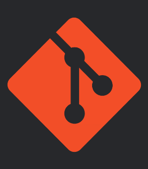

### ¿Como nacio GIT?
GIT nacio un en abril del 2005 creado por Linus Torvalds, antes de siquiera pensar en la creacion de git exitia lo que es Bitkeeper y el señor Torvals usaba este ya que era gratuito peroun dia los de Bitkeeper decidieronempesar a cobra por los usos de este cosa que no le gusto a linus Torval por lo que enojado decidio encerarse en su cuarto unas 2 a 3 semana para crear algo mejor  que Bitkeeper y asi nacio por un enfado xd

### ¿Como instalar GIT?
#### En windows
Simplemente tienes que :
  * ir a tu buscador favorito
  * buscar git y apretar en downloads
  * aceptar las configuraciones segun tu gusto
  * verificar la instalacion con git --version en el cmd
#### En linux
 Casi lo mismo que windoons pero:
  * vas a tu navegador
  * buscas git y entras en la parte que dice linux
  * copias el codigo segun la distrubucion que tengas
  * lo pegas en tu terminal 
  * revisas que se instalo con git --version en la terminal
    
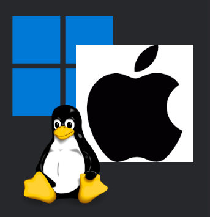

### Configuraciones Básicas 
 * git config --global user.name "Tu Nombre"
 * git config --global user.email "tu@correo.com"
 * git config --global core.autocrlf true
# Clase 2
### States y commits
* **STATES** sirve para inicialisar el guardado y cuales quieres guardar
* **COMMITS** es el comentario que subes para decir que cambio hiciste

### Los estados de GIT
#### Directorio de trabajo(Modificado)
Este una carpeta en la que GIT observa tus archivos y los cataloga en:
* **Untracked** Es decir sin seguimiento osea ve el archivo pero no tiene unseguimiento ni versiones antiguas de este. 
* **Modified** Es con una version antigua guardada un archivo que guardaste y que quieres modificar
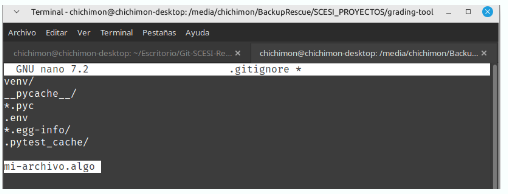

#### ¿Que pasa si el archivo no me gusto y quiero que se quede la version anterior?
Para pasar de Modified a suestado original solo tienes que hacer este codigo
* **git restore <archivo>**
esto borra todo lo que se escrivio en la ultima entrada

#### ¿Que pasa si quiero que un archivo no se vea?
Para quetu codigo funcione pero no se vea tus patrones o tokens o algo que no quieres que sea publico se crea la carpeta **gitignore**  en este entrara todo tus datos 
#### Stage area(Preparado)
seleciona archivos modificados que se incluiran en el sigiuente commit (guardado)
* **git add<archivo>** Agrega un archivo solo el que eliges 
* **git add .:** Agrega todos los archivos que este observados por git
si quieres sacar un archivo del stage area para volver al anterior 
** git restore --staged <archivo>**
#### Repositorio local
Aqui es cuando ya estamos decididos a subir el proyecto y guardar los cambios para quepasen a ser parte del historial
* **git commit -m "mensaje"**
y si quieres desaserte de tu ultimo commmit solo tienes que hacer:
* **git reset --soft HEAD~1**

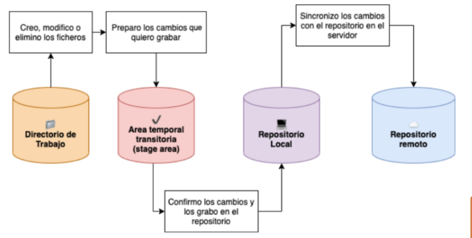

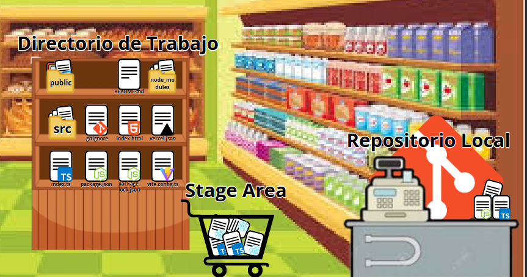

### Buenas practicas 
#### ¿Cada cuanto hacer un commit?
Usar los commits atómicos. son una práctica de git donde cada confirmacion(commit)representa un cambio logico pequeño o que no afecte tanto 

### ¿Escribe buenos commits?
un commmit debe de ser muy corto y muy descriptivo por eso se usa :
**1 Verbos imperativos(Add,change,fix,remove)**
*  **Add** Significa que se añade un archivo
* **Change** Significa que se modifica unarchivo existente
* **Fix** Significa que se arreglo un BUG
* **Remove** significa que se elimina un archivo existente
**2 NO uses punto final ni suspensivos**
usar puntuacion mas allá de las comas es innecesarioa la hora de crear un buen mensaje

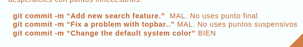

**3 no usar mas de 50 caracteres**
se corto y conciso si no tienes mucho que explicar es probable que tu commit contenga demaciado cambias
**4 usar un prefijo para hacerlos mas semanticos**
para que tu historial sea mas legible
* **git commit -m "<tipo de commit>: <Descripcion>"**
* **git commit -m "feat:add new search feacture"**

**Escribe buenos commits**
* **feat:** para una nueva característica para el usuario.
* **fix:** para un bug que afecta al usuario.
* **perf:** para cambios que mejoran el rendimiento del sitio.
* **build:** para cambios en el sistema de build, tareas de despliegue o instalación.
* **ci:** para cambios en la integración continua.
* **docs:** para cambios en la documentación.
* **refactor:** para refactorización del código como cambios de nombre de variables o funciones.
* **style:** para cambios de formato, tabulaciones, espacios o puntos y coma, etc; no afectan al usuario.
* **test:** para tests o refactorización de uno ya existente

**5 añadir contexto al cuerpo del commit**
En ves de saturar el sumario de commit añade informacion nesesaria en el cuerpo del mensajeen aqui si puedes usar reglas de puntuacion
**git commit**
**prefijo:Titulo de tu commit**
**cuerpo que describe tu commit**

# Clase 3

### Empezamos con GitHub 

GitHub es como una red social para proyectos de programación. Me permite guardar mi código en la nube, trabajar en equipo, y llevar el control de todos los cambios que hago con Git. Básicamente, uso Git en mi compu para manejar versiones del código, y luego uso GitHub para subir todo eso a internet y colaborar con otros. 

### ¿Git y GitHub son los mismos?

Git y GitHub no son lo mismo, aunque se usan juntos casi siempre.
Git es una herramienta que tengo instalada en mi compu y me sirve para guardar los cambios que voy haciendo en mi código, llevar un control de versiones, y no perder nada si rompo algo. Todo eso lo hago de forma local, sin necesidad de internet.

En cambio, GitHub es una página web donde puedo subir esos proyectos que manejo con Git, para tenerlos en la nube, compartirlos con otros y trabajar en equipo. Es como el “Google Drive” de los proyectos de código, pero mucho más pro porque tiene herramientas para colaborar, revisar cambios, automatizar tareas, y más.

En resumen: Git es la herramienta, y GitHub es el lugar donde subo lo que hago con esa herramienta.

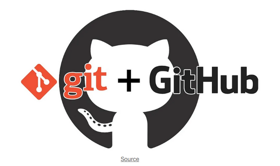

## ¿GitHub es único?
no es el  unico pero si es el mas popular pero esxisteno otras como

| Plataforma     | ¿Qué ofrece?                                                                 |
|------------------|----------------------------------------------------------------------------------|
| **GitHub**        | La más conocida, con muchas herramientas para colaboración y automatización.   |
| **GitLab**        | Muy completo, permite tener repos privados gratis y tiene CI/CD integrado.     |
| **Bitbucket**     | Integrado con Atlassian (como Jira), muy usado en entornos empresariales.      |
| **SourceForge**   | Más antigua, orientada a proyectos de código abierto (open source).            |
| **Azure DevOps**  | De Microsoft, muy útil para gestionar código, tareas y despliegues.            |

## Para que sirve cada uno de los comandos

ABREME!!!!! 

### Comandos

| **Comando**                                                                   | **Descripción**                                                                                                                |
|-------------------------------------------------------------------------------|--------------------------------------------------------------------------------------------------------------------------------|
| `git init`                                                                     | Inicializa un repositorio Git en la carpeta local, preparándolo para empezar a realizar seguimientos de cambios.               |
| `git add .`                                                                    | Agrega **todos los archivos** modificados al área de preparación (staging area) para ser incluidos en el próximo commit.        |
| `git commit -m "primer commit"`                                                | Crea un commit con un mensaje descriptivo que guarda el estado actual del repositorio.                                         |
| `git remote add origin https://github.com/1Godoy123/scesi.git`                 | Conecta tu repositorio local con el repositorio remoto de GitHub, permitiendo sincronización de archivos entre ambos.           |
| `git push -u origin main`                                                      | Empuja los cambios locales de la rama `main` hacia el repositorio remoto en GitHub. El `-u` establece la relación para futuros `push`. |

* **Podemos veer informacion de otras personas pero como es algo izi y no quiero llena mucho espacio enbano entonces no lo mostrare solo mostrare como se ve  el perfil de una persona XD

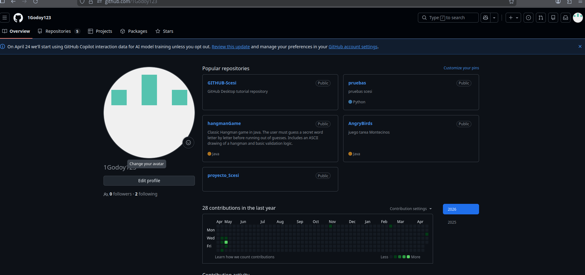

## como clonar un repositorio
|comando    | descripcion|
|------------------|--------------|
|git clone "https://github.com/usuario/repositorio.git"   |     Clona un repositorio remoto de GitHub en tu máquina local. Solo necesitas reemplazar la URL con la del repositorio que deseas clonar.|
|cd repositorio          |   Entra en la carpeta del repositorio recién clonado, para empezar a trabajar en él.|

## Como escribir en un repositorio remoto 
para hacer esto tienes que tener actualizado el bash
* **git add .**
Después de hacer los cambios, agrega los archivos modificados al área de preparación (staging area).

* **git commit -m "Descripción de los cambios"**
Realiza un commit con un mensaje que explique los cambios que hiciste.

* **git push origin main**
Finalmente, sube los cambios al repositorio remoto en la rama main. Si estás trabajando con otra rama, reemplaza main con el nombre de tu rama.

| **git**       | **Para qué sirve**                                                                                                                                                                           |
|---------------|---------------------------------------------------------------------------------------------------------------------------------------------------------------------------------------------|
| **git pull**  | **Función**: Descargar los cambios del repositorio remoto y actualizar tu repositorio local con esos cambios.   **Dirección de los cambios**: Va de remoto a local.   **Cuándo usarlo**: Lo usas cuando quieres obtener los cambios que otras personas han subido al repositorio remoto (por ejemplo, en GitHub) para tener la versión más reciente del proyecto en tu máquina local.   **Ejemplo**: Si otros colaboradores han hecho cambios en la rama `main` en GitHub y quieres obtener esos cambios en tu repositorio local, usas `git pull`. |
| **git push**  | **Función**: Subir los cambios de tu repositorio local al repositorio remoto.   **Dirección de los cambios**: Va de local a remoto.   **Cuándo usarlo**: Lo usas cuando has hecho cambios en tu repositorio local (como agregar archivos, modificar código) y quieres compartir esos cambios con otras personas o guardarlos en el repositorio remoto (como GitHub).   **Ejemplo**: Después de hacer un commit con tus cambios, usas `git push` para subir esos cambios al repositorio remoto. |

 Comandos de git pull❓❓❓ 

| **Comando**                                       | **Descripción**                                                                                                                           |
|---------------------------------------------------|-------------------------------------------------------------------------------------------------------------------------------------------|
| `git pull origin main`                            | **Función**: Descarga los cambios de la rama `main` del repositorio remoto (por ejemplo, en GitHub) y los fusiona con tu rama local.       |
| `git pull origin nombre-de-la-rama`               | **Función**: Trae los cambios de la rama remota `nombre-de-la-rama` y los fusiona con tu rama local.                                        |
| `git pull nombre-del-remoto nombre-de-la-rama`    | **Función**: Si tienes más de un repositorio remoto configurado, especifica desde qué remoto deseas hacer el pull.                        |
| `git pull --no-commit origin main`                | **Función**: Trae los cambios de la rama `main`, pero **no hace el commit automáticamente**. Puedes revisar antes de confirmar el merge. |
| `git pull --rebase origin main`                   | **Función**: Aplica tus cambios encima de los cambios del remoto en lugar de hacer un merge, manteniendo un historial más limpio.          |

 Comandos de git push❓❓❓ 

| **Comando**                                       | **Descripción**                                                                                                                           |
|---------------------------------------------------|-------------------------------------------------------------------------------------------------------------------------------------------|
| `git push origin main`                            | **Función**: Sube los cambios locales de la rama `main` al repositorio remoto (por ejemplo, en GitHub).                                     |
| `git push origin nombre-de-la-rama`               | **Función**: Sube los cambios locales de la rama `nombre-de-la-rama` al repositorio remoto.                                                |
| `git push --set-upstream origin nombre-de-la-rama`| **Función**: Establece la rama remota como el origen para la rama local, útil cuando creas una nueva rama local y la subes por primera vez. |
| `git push origin --delete nombre-de-la-rama`      | **Función**: Elimina la rama `nombre-de-la-rama` del repositorio remoto.                                                                  |
| `git push -u origin main`                         | **Función**: Sube los cambios de la rama `main` y establece una relación de seguimiento con la rama remota, facilitando futuros `push`.    |

## Que es un PR
Un Pull Request (PR) es como cuando terminas de hacer cambios en tu proyecto y quieres que otras personas los vean antes de agregarlo a la versión principal. Así que, cuando trabajo en una rama diferente (digamos que en una nueva idea o característica) y quiero que esos cambios lleguen a la rama principa

| **Comando**                                      | **¿Para qué sirve?**                                                                                   |
|--------------------------------------------------|--------------------------------------------------------------------------------------------------------|
| `git checkout main`                              | Me aseguro de estar en la rama principal antes de crear una nueva rama.                               |
| `git pull origin main`                           | Actualizo mi rama principal local con los últimos cambios del repositorio remoto.                     |
| `git checkout -b nombre-de-mi-rama`              | Creo una nueva rama a partir de `main` para trabajar mis cambios.                                     |
| *(Aquí edito archivos normalmente)*              | Hago los cambios que quiero en el proyecto.                                                           |
| `git add .`                                      | Agrego todos los archivos modificados al área de preparación para el commit.                          |
| `git commit -m "Descripción de mis cambios"`     | Registro los cambios que hice con un mensaje descriptivo.                                             |
| `git push origin nombre-de-mi-rama`              | Subo mi nueva rama y los cambios al repositorio remoto (GitHub, por ejemplo).                         |

# Clase 4
### Git Remote 	
Este sirve para controlar nuestras conexiones con los repositorios remotos para saber donde enviar y de donde traer la informacion esto son los comandos:
* **git remote -v** Nos permite ver donde apunta nuestro repositorio
* **git remote add <apodo> "url"** vincula un repositorio local con uno en la nube
* **git remote set-url <apodo> "url"** cambia la url donde apunta nuestro repositorio
  

### Multiples SSH
Si tenemos mas de una cuenta de GitHub o nesecitamos tener otras cuentas es util tener mas de un allave SSH,es como tener una llave para cada puerta,una no abre otra puerta

### Configurar multiples SSH
* **Paso 1** generamos el sshkey con otro nombre
* **Paso 2** Creamos un archivo config para que no choquen las key
* **Paso 3** verificamos que funcione

  

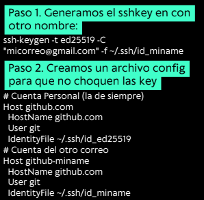   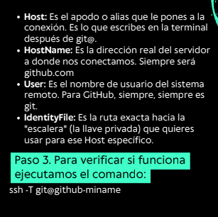

### Configuraciones locales
Las configuraciones locales se imponen a las globales y estas solo funcionan para el repositorio
* **git config user.name "Mi nuevo nombre"**
* **git config user.email "tu@gmail.com"**

### Git Checkout
Es el comando que nos permite desplasar el HEAD hacia un punto especifico de tu historial
* **Para que sirve?**
* **inspeccionar** ver como era el codigo antiguo 
* **Restaurar** recuperar archivos borrados o cambiados
* **Experimentar** Probar cambios sin arruinar la rama principal
* **Cambiar** saltarnos de una rama a otra 

### El Estado "Detached HEAD"
en esta eres un espectador en el pasado ver todo y escribir nota pero no tienesn cuerpo y si te vas al presente sin "encarar" en una rama se pierden tus cambios
### Como ir y volver de un commit
* **git checkout <hash_antiguo>**Para ir atras debes hacer
**git checkout <rama>**Y para volver al ultimo hash de la rama

Si hiciste algo aca (como un commit) desaparece
salvo que hagas:
**git checkout <hash_commit_creado>**
**git checkout -b rama_nueva**

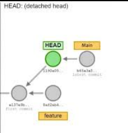

### Buenas practicas del Checkout
* **No trabajes mucho en 'Detached HEAD'"** si vas a escribir mucho mejor crea una rama nueva
* **Limpia tu direccion de trabajo** antes de volver a un comit has un commit en  tu rama actual para poder volver al pasado si no git no te dejara volver
* **Usalo para aprender** Hacer checkout a commits de proyectos grandes es la mejor forma de ver como crecieron

# Clase 5
### Ramas y GitFlow basico
La base del trabajo remote en git

### ¿Que son las ramas?
 
las ramas son utilidades de Git  que se usa para llevar un mejor control del codigo

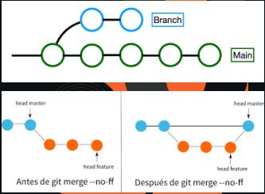

### Git Branch

este es un comando que permite gestiionar las ramas que tiene o tendra nuestro proyecto

* **git branch** lista las ramas disponibles y muestra tu pocicion actual
* **git branch <rama>** crea una rama en la rama que estamos pocecionados 
* **git branch -D <rama>** borra la rama

### Git checkout enfocado en ramas

se usa para ver archivos pasados pero tambien para cambiar de ramas y crear una rama y te mueve a ella directamente

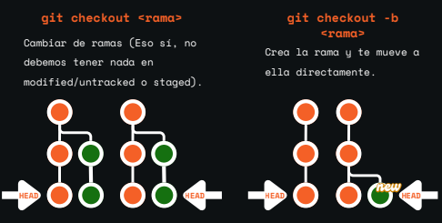

### Git checkout vs git switch
####¿Por que existen ambos? 
La diferencia es muy facil la vedad el git checkout es multipropocitopero puede dejarte en detached HEAD  y el git switch es espeecialisado en ramas y evita accidente  a la hora de moverte

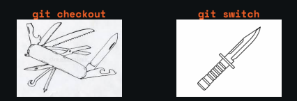

### GitFlow Basico
#### ¿Que es?
Es un flujo de trabajo el cual nos permite trabajar de manera ordenada en nuestra ramas versiones y permite unna facil adaptacion

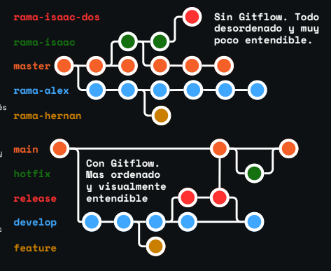

#### Como funciona Gitflow

| **Comando**                                      | **¿Para qué sirve?**                                                                                   |
|--------------------------------------------------|--------------------------------------------------------------------------------------------------------|
| `main`                                           | Su propocito es crear y contener el codigo que se encuentra en producion                                       |
| `develop`                                        | Es la rama de PreProduccion su propocito es tener caracteristicas que estan aprueba pero todavia no han sido validadas                     |
| `ramas de apoyo`                                 | Somos ramas que nos permitian escribir nuestro codigo estas son feature release y hotfix                                     |

### Ramas de apoyo
* **feature** Cuando trabajas en una nueva caracteristica para el proyecto
* **release** Cuando preparas el lanzamiento de una nueva vercion
* **hotfix** Para trabajar en cambios imprecistos como parches para arreglar un bug o un problema en produccion 

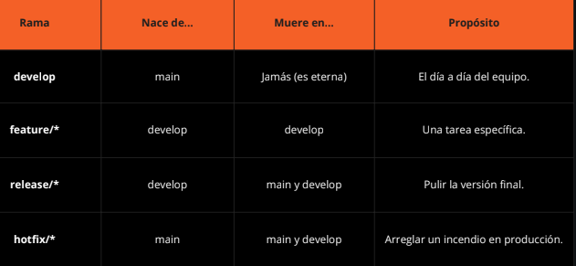

# clase 6
### ¿Que es git merge?
Merge significa fusion, entonces esto quiere decir que nos permite fusionar nuestras ramas en una sola para que ambas tengan los commits hechos 

* **-no-ff** que significa no fast forward

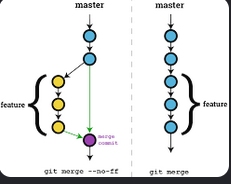

este codigo hace que se pierda el historial de ramas y te fuerse a hacer un commit para tu merfesin que pierdas el historial de ramas, aun si la borras
### ¿Que es git fetch?
es el comando que permite ver si hubo cambios en la rama y sus ramas hijas
### ¿Que es git pull?
el comnando git pull permite traer todos los cambiosque tiene el repositorio remoto de esa rama Se usa para el origin y el nombre de la rama para que no tengas problema al subirla 

* **git pull origin rama**

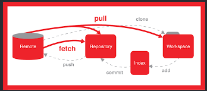

### Que es git push?
es el comando que sube tus cambios al repositorio remoto de esa rama con

* **git push origin rama**

si no es tu repositorio la primera ves que hagas push de tu rama debes hacerlo con el **flag -u** para que no tengan que pedir permiso

* **git pull origin -u rama**

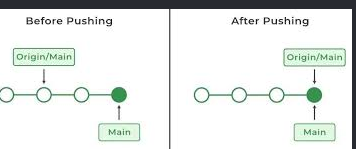

### flujo de trabajo(Sin pull requests)
#### git checkout develop
se usa cuandoquieres cambiar el directorio de trabajo a la rama develop. Esta rama se usa comunmente en  flujos de trabajo de desarrollo

#### git fetch
Este comando se utilisa para descargar confirmaciones, archivos y referencia de un repositorio remoto a un repositorio local
#### git pull origin develop
es una instruccion estandar de git que se utilisa para actualisar la rama local actual con los ultimos cambios de la rama develop en el servidor remoto

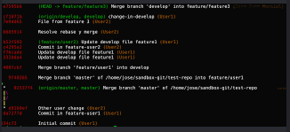

#### git merge -no-ff rama
se utilisa para fusionar la rama llamada "rama" en tu rama actual, forzando siempre la creacion de un commit de fusionincluso si git pudiera realisar un "fast-forward"

*  **git add .** Indica a Git que ya revisaste los archivos y que los conflictos están resueltos manualmente.

* **git commit** Finaliza oficialmente la fusión. Crea el "Merge Commit" que une ambas ramas en el historial.

* **Editor (Nano/Vim)** Se abre automáticamente para que confirmes el mensaje del commit (ej. Merge branch 'rama' into develop).

* **git branch -d** Borra la rama auxiliar una vez que sus cambios ya están seguros en la rama principal.

* **git push** Actualiza el servidor remoto con el resultado de la fusión.

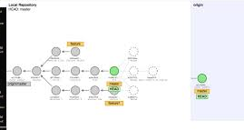

# Clase 7 
### Que son lo pull request?
Tambien informalmente llamados (PRs) es la forma progecional dde trabajr con git/gothubeset vrea um reques para este permite ver que se quiere mergear en el sistema
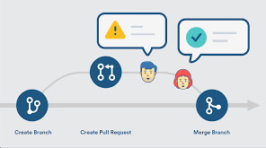
### Como crear un PR
para ello lo primero que hagas debe de ser  **git push origin main** deves de rederigirte a github y segiuir el tuto **https://youtu.be/4CeMKqloOJc**

#### Flujo de trabajo (Con pull request)
* Flujo de trabajo (Con Pull Requests)
* git checkout develop
* git fetch
* git pull origin develop
* git checkout rama # Agregas -b si estás creando la rama
* git merge develop # Solo si hubo cambios en develop

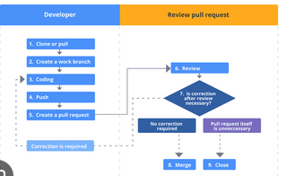
#### Trabajas en tu rama
git push origin rama # Agregas -u si es la primera vez que subes cambios al repositorio remoto
git checkout develop
git fetch
git checkout rama
git merge develop # Solo si hubo cambios en develop antes de hacer la PR
#### Resuelves manualmente los archivos fallidos y sus conflictos
git add .
git commit
[Ctrl + O, Enter, Ctrl + X](depende si usan nano)
git push origin raiz

### Por que usamos los PRs si ya podemos trabajar normalmente sin ellos

los usamos por temas de segurida, que cualquier colaborador pueda tocar nuestro repositorio por temas de seguridad que cualquier colaborador pueda tocar nuestro repositorio y mergear sin preguntar o avisar es un iesgo constante

los PRs permite al equipo y lo fuerza a ver los cambios , limita la colaboracion y obliga al debate confiado entre nuestros colaboradores
 
### Como proteger mi repositorio y limitar la colaboracion?
ya sabemos la importancia de los PRs pero aun asi o menos limitado nada seguimos confiando en nuestros colaboradores

